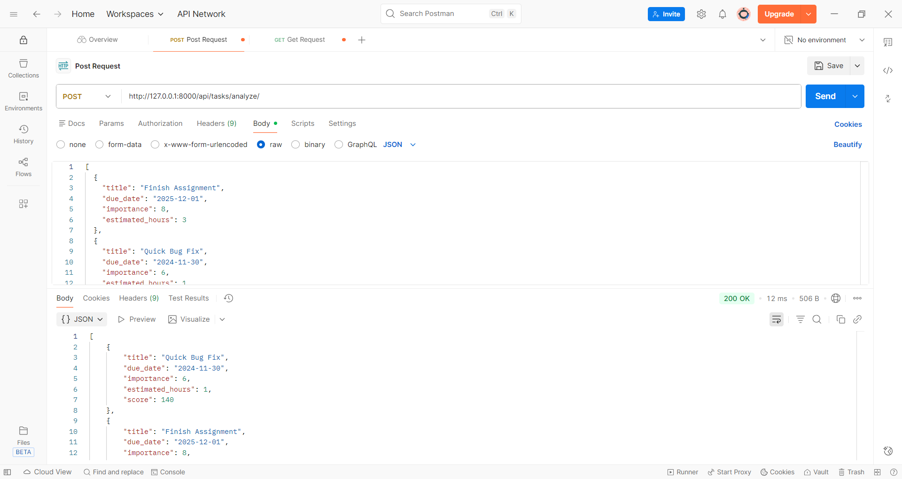
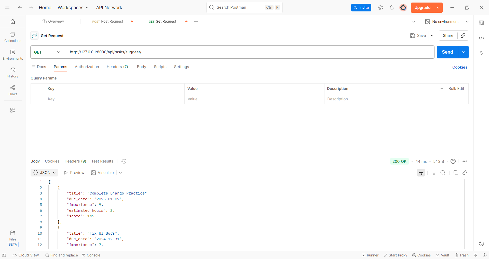
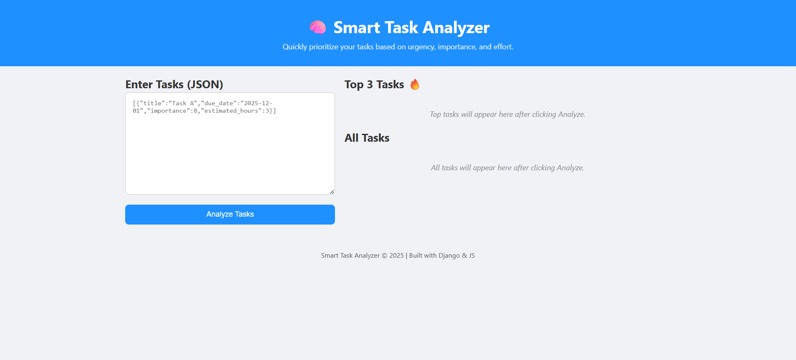
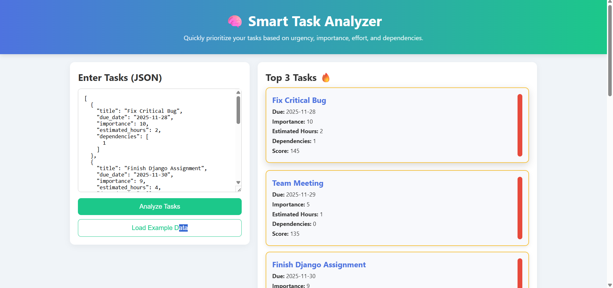

# 🧠 Smart Task Analyzer

## Overview
**Smart Task Analyzer** is a mini-application designed to help users prioritize tasks based on **urgency, importance, estimated effort, and dependencies**.  
The app scores tasks and displays them in order of priority, so users can quickly decide what to work on first.

---

## Features

- Add tasks via **JSON input**  
- Analyze tasks and assign **priority scores**  
- Dynamic display of tasks with **color-coded priority bars**  
  - Red = High Priority  
  - Yellow = Medium Priority  
  - Green = Low Priority  
- **Top 3 tasks** highlighted with a gold border  
- Responsive design: Works on **all screen sizes**  
- Handles **edge cases** like overdue tasks or missing fields  
- Placeholder text guides the user before analyzing

---

## Scoring Algorithm

Each task is assigned a **numerical score** using the following logic:

| Factor | Weight / Rule |
|--------|---------------|
| Overdue | +100 (tasks past due get highest priority) |
| Due within 3 days | +50 |
| Importance | `importance × 5` |
| Quick task (<2 hours) | +10 |
| Dependencies | Reduce priority slightly if dependencies exist |

> Higher score → higher priority

---

## Tech Stack

- **Backend:** Django 4  
- **Frontend:** HTML5, CSS3, Vanilla JavaScript  
- **Database:** SQLite (default with Django)  

---

## Project Structure

```bash
task-analyzer/
├── backend/ # Django Project Folder
├── tasks/ # Django App (models, views, scoring.py)
├── frontend/ # Frontend files (index.html, styles.css, script.js)
├── manage.py
├── db.sqlite3
└── requirements.txt
```

---

## Setup & Run

### 1. Clone the repository
```bash
git clone <your-repo-url>
cd task-analyzer
```

### 2. Create virtual environment

```bash
python -m venv venv
```
# Activate environment

```bash
venv\Scripts\activate   # Windows
```
```bash
source venv/bin/activate   # Mac/Linux
```

### 3. Install dependencies

```bash
pip install -r requirements.txt
```
### 4. Run Django server

```bash
python manage.py runserver
```

### 5. Open Frontend

Open ```frontend/index.html``` in Live Server (recommended) to use the UI.

---

## API Endpoints

### POST ```/api/tasks/analyze/```

    * Accepts a list of tasks in JSON format

    * Returns tasks sorted by priority score

### GET ```/api/tasks/suggest/```

    * Returns the top 3 tasks to work on today

---

## Example JSON Input

```json
[
  {"title":"Fix Critical Bug","due_date":"2025-11-28","importance":10,"estimated_hours":2},
  {"title":"Finish Django Assignment","due_date":"2025-11-30","importance":9,"estimated_hours":4},
  {"title":"Team Meeting","due_date":"2025-11-29","importance":5,"estimated_hours":1},
  {"title":"Prepare Presentation","due_date":"2025-12-05","importance":7,"estimated_hours":3},
  {"title":"Quick Code Refactor","due_date":"2025-12-10","importance":6,"estimated_hours":1},
  {"title":"Write Documentation","due_date":"2025-12-15","importance":4,"estimated_hours":2}
]
```

## Notes

* Ensure tasks use double quotes in JSON

* Frontend is responsive and works on desktop and mobile

* Designed for easy extension (e.g., adding new scoring rules or task categories)

## 📸 Screenshots

### 🔹 Analyze API (POST)


### 🔹 Suggest API (GET)


### 🔹 Frontend — Before Analysis


### 🔹 Frontend — After-page_1 Analysis


### 🔹 Frontend — After-page_2 Analysis

